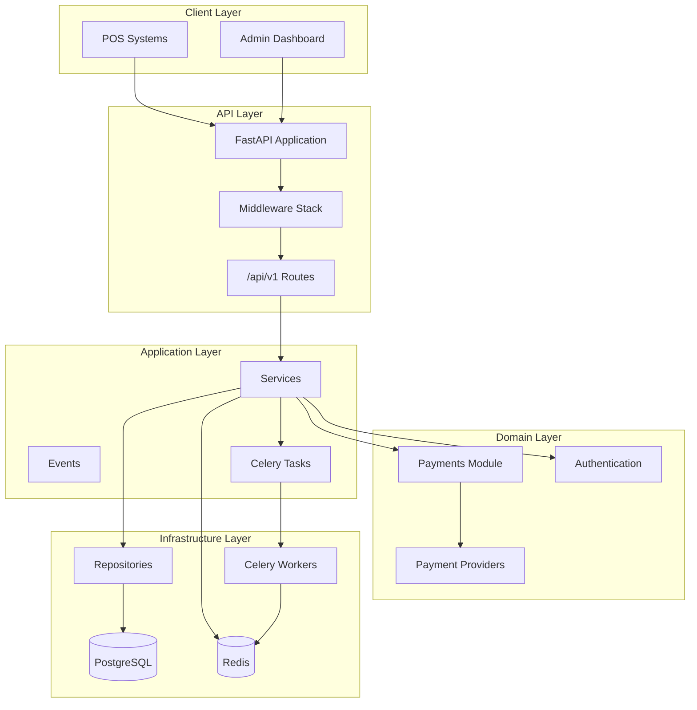
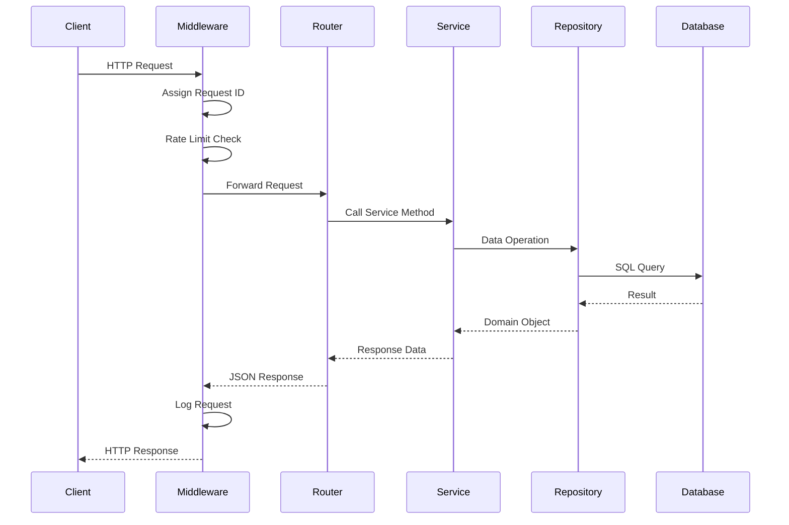

# POMPO Backend — Architecture Overview

## System Context

POMPO is a payment bridge for Malawi that connects retail POS systems to Airtel Money, TNM Mpamba, and bank payment rails. It routes payment requests and monitors settlements without storing customer funds.

## Architecture Diagram



## Layer Responsibilities

| Layer | Responsibility |
|-------|---------------|
| **API** | HTTP routing, request validation, response serialization |
| **Services** | Business logic orchestration |
| **Repositories** | Data access abstraction |
| **Models** | SQLAlchemy ORM entities |
| **Schemas** | Pydantic request/response models |
| **Middleware** | Cross-cutting concerns (logging, CORS, rate limiting) |
| **Workers** | Background task processing via Celery |

## Request Flow



## Dependency Injection

All dependencies flow through FastAPI's `Depends()` system:

- **Settings** → loaded from environment via Pydantic BaseSettings
- **Database Session** → async session per request
- **Redis Service** → shared connection pool
- **Services** → constructed with injected dependencies

## Environment Configuration

Three environment profiles are supported:

- **Development** — debug logging, console output, relaxed validation
- **Testing** — minimal logging, isolated database
- **Production** — JSON logging, strict secret validation

Set `APP_ENV=development|testing|production` to select the profile.

---

## M002 — Domain Model & Database

Fifteen core entities are now mapped under `app/models/`, split by bounded
area rather than one giant file:

- `app/models/base.py` — declarative `Base`, a portable `GUID` type
  (native `UUID` on PostgreSQL, hex-string `CHAR(32)` elsewhere so the model
  layer is unit-testable against SQLite), and `TimestampMixin` /
  `SoftDeleteMixin`.
- `app/models/organization.py` — Merchant, Branch, Till.
- `app/models/user.py` — User, Role, Permission, RolePermission.
- `app/models/payment.py` — PaymentProvider, Transaction, PaymentAttempt,
  WebhookEvent, QRCode, Receipt.
- `app/models/audit.py` — APIKey, AuditLog.
- `app/models/enums.py` — `TransactionStatus`, `PaymentAttemptStatus`,
  `ProviderCode`, `UserRoleCode`.

### Design decisions

- **UUID primary keys everywhere**, generated client-side (`default=uuid4`)
  rather than relying on a DB default, so IDs are available before flush.
- **Soft delete is opt-in and explicit.** `SoftDeleteMixin` adds
  `deleted_at`; nothing filters it out automatically. Repositories that want
  "active only" semantics call `BaseRepository.get_active_by_id`.
  `AuditLog` deliberately does **not** get soft delete or `updated_at` —
  audit rows must never be mutated or hidden.
- **No provider-specific logic lives in these models.** `PaymentProvider`
  and `PaymentAttempt` are storage shape only; the adapter pattern that
  turns "call Airtel Money" into a real HTTP call is a later milestone
  (M008+).
- **RolePermission is a full entity**, not a bare association table, so
  grants can carry `granted_at` and future audit metadata.

### Verification performed

- `configure_mappers()` succeeds — every relationship resolves.
- `Base.metadata.create_all()` succeeds against SQLite (portability check).
- `tests/test_models.py` (4 tests) exercises the full checkout relationship
  chain, a unique-constraint violation, one-to-one QR/Receipt links, and
  soft-delete query filtering — all passing.
- The initial Alembic revision (`migrations/versions/0001_initial_domain_schema.py`)
  was cross-checked line-by-line against
  `CreateTable(...).compile(dialect=postgresql.dialect())` output for every
  table. It was **not** run against a live PostgreSQL instance (none is
  reachable from the environment this was built in) — run
  `docker compose up -d db && alembic upgrade head && alembic check` before
  trusting it in a real environment.

### Known limitations / next milestone

- Merchant and branch repositories, services, schemas, routes, tenant checks,
  soft-delete behavior, and audit records are implemented in M005.
- Till/Cashier management remains a later milestone.
- No seed data yet (M016 area) and no transaction *state machine*
  enforcement yet (M011) — the DB will currently accept any status value in
  the enum regardless of what state preceded it.

---

## M003 — Authentication & Identity

### New modules

- `app/core/security/password.py` — bcrypt-based `PasswordHasher` (rewritten
  this milestone, see docs/decisions.md) plus `get_dummy_password_hash()`
  for timing-safe unknown-email rejection.
- `app/core/security/jwt.py` — extended (not replaced): `create_refresh_token`
  now requires a `jti` tying the token to its server-side session; added
  `refresh_token_expire_days` accessor.
- `app/core/security/exceptions.py` — `AuthError` hierarchy. Deliberately
  FastAPI-agnostic; the API layer maps these to HTTP responses.
- `app/models/auth.py` — `RefreshSession` (new table, migration `0002`).
- `app/repositories/user.py`, `app/repositories/auth.py` — `UserRepository.
  get_by_email`, `RefreshSessionRepository.revoke_family`.
- `app/services/auth.py` — `AuthService`: `login`, `refresh`, `logout`,
  `get_current_user`. All business logic; no FastAPI imports.
- `app/schemas/auth.py` — `LoginRequest`, `RefreshRequest`, `LogoutRequest`,
  `TokenResponse`, `AuthenticatedUserResponse`.
- `app/api/v1/auth.py` — `POST /auth/login`, `POST /auth/refresh`,
  `POST /auth/logout`, `GET /auth/me`.
- `app/api/deps.py` — extended with `AuthServiceDep`, `get_current_user`
  (Bearer-token dependency), `CurrentUserDep`.

### Token lifecycle

```
login  ─────────────► access_token (JWT, ~30 min)
                       refresh_token (JWT, ~7 days) ─► RefreshSession row
                                                        (family_id = id)

refresh(token) ──────► validate signature + type
                        look up RefreshSession by jti
                        ├─ already revoked?  → REPLAY: revoke whole family, 401
                        ├─ expired?          → 401
                        ├─ hash mismatch?    → 401
                        └─ OK → revoke old row, issue new (same family_id)

logout(token)  ──────► revoke the one RefreshSession row (idempotent, silent)

/me (access_token) ──► decode + verify type=access → load User → check is_active
```

Full design reasoning (why hybrid JWT+session, why family-based replay
detection, why SHA-256 not bcrypt for the token hash, why access tokens
aren't server-revocable) is in **docs/decisions.md**.

### What M003 deliberately does NOT do

- No role/permission checks anywhere — `get_current_user` answers "who",
  not "what are they allowed to do". That's M004.
- No `iss`/`aud` JWT claims (deferred — see decisions.md).
- No access-token revocation/blocklist (deferred — see decisions.md).

### Verification performed this milestone

- `tests/test_auth_service.py` — 25 tests, SQLite-backed, **executed,
  all passing**: password hashing/verification, login (valid/wrong
  password/unknown email/inactive), access token (valid/malformed/expired/
  wrong-type), refresh (valid/rotation/family-id continuity/expired/
  replay/malformed/wrong-type), logout (revokes/idempotent/garbage-input-safe),
  and two explicit security assertions (no `hashed_password` in the `/me`
  response schema; only a hash of the refresh token is ever persisted).
- `tests/test_auth_api.py` — 9 HTTP-level tests against the real FastAPI
  app and endpoints. **Written but NOT executed** — they require the
  project's existing `client`/`db_session` fixtures, which need a live
  PostgreSQL + Redis instance not available in the sandbox this was built
  in (same constraint `tests/test_database.py` already had). They do
  successfully **collect** (`pytest --collect-only` passes), confirming no
  import/syntax errors. Run `docker compose up -d && pytest
  tests/test_auth_api.py -v` to execute them for real.
- Full suite `tests/` (excluding the pre-existing `test_database.py`):
  **34/34 passing** (9 from M001/M002 + 25 new).
- `app.openapi()` confirms all four routes are registered under
  `/api/v1/auth/*`.
- Migration `0002_refresh_sessions.py` was cross-checked against
  `CreateTable(RefreshSession.__table__).compile(dialect=postgresql.
  dialect())` — matches exactly. Not run against a live database (same
  caveat as migration `0001`).

### A bug this milestone found in the inherited M001 foundation

`app/core/security/password.py` (as built in M001) used `passlib
[bcrypt]`, which had never actually been exercised by a test. Writing
M003's first password test immediately surfaced a real incompatibility
between passlib (unmaintained since 2020) and the installed `bcrypt` 5.x —
see docs/decisions.md for the fix (switched to calling `bcrypt` directly).
This is exactly the kind of latent defect M001's "no placeholder
implementations" checklist couldn't catch, since the code imported and the
app started fine; it only broke the first time it actually hashed a
password.

## M004 — Authorization and RBAC Administration

Authentication remains responsible for resolving an active identity. The
separate `AuthorizationService` resolves exact permission codes through the
active role and `require_permission()` provides reusable FastAPI enforcement.
RBAC administration is exposed under `/api/v1/rbac` and routes delegate all
mutations to `RBACService`, which owns authority, escalation, system-role,
tenant-scope, and audit checks.

Permissions are system-defined catalog entries using stable lowercase
`resource:action` identifiers. Custom roles may be created and deactivated,
but system roles cannot be modified or deleted. A custom role may only be
given permissions already held by the actor, and a role may only be assigned
when its effective grants do not exceed the actor's authority. Platform-admin
assignment is restricted to an existing platform administrator.

The current single `User.role_id` model remains intentional for M004. Role
removal is rejected because users must retain one role; future multi-role
support requires a deliberate expand-and-contract migration. Merchant and
branch scope primitives reject cross-tenant access, while role rows are still
global because the existing schema has no role-to-merchant ownership column.
Full tenant-owned role management remains deferred because the existing schema
has no role-to-merchant ownership column.

## M006 — Payment Core

The payment core exposes `/api/v1/payments` for provider-neutral payment
creation, lookup, and cancellation. `PaymentService` validates active merchant,
branch, and till ownership, creates a transaction and initial attempt, and
uses a merchant-scoped idempotency key plus request fingerprint to make retries
deterministic. `state_machine.py` is the single source of truth for lifecycle
transitions; provider adapters are represented only by a future-facing protocol.

## M007 — Provider Integration

Provider adapters implement a shared normalized contract. `ProviderRegistry`
resolves provider codes to adapters, `ProviderCapabilities` advertises
supported operations, and normalized provider errors expose retryability without
leaking provider-specific exceptions into the payment core. Mock adapters cover
success, pending, rejection, and timeout outcomes. Provider request/response
metadata and normalized status are retained on payment attempts. Live Airtel,
TNM, and bank integrations remain deferred until approved credentials and
provider contracts exist.

## M005 — Merchant and Branch Administration

Merchant and branch administration is exposed under `/api/v1/organization`.
Repositories filter normal reads to active, non-deleted resources. Services
enforce merchant ownership for every operation, restrict branch-assigned users
to their branch, allow platform administrators to cross tenant boundaries, and
write immutable audit records for mutations. Migration `0004` adds the M005
permission contracts and assignments idempotently.
